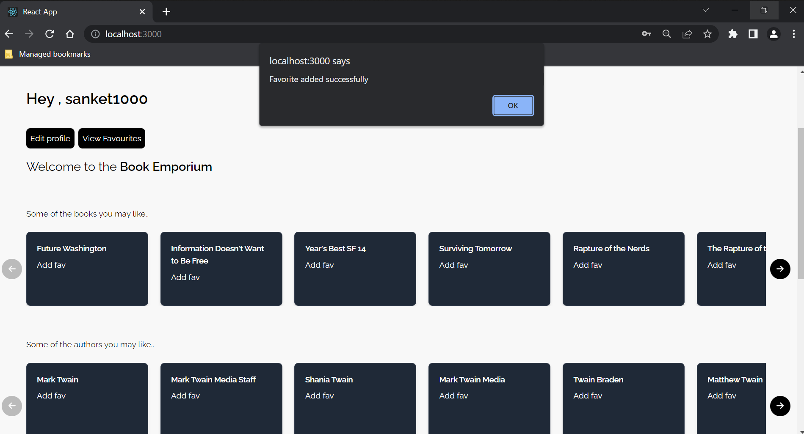

# Capstone Project for Croma Campus (Internal Training)

The project is a ongoing project prepared to demonstrate the course content effectiveness by creating a Weather app to demostrate prficiency in the technology involved in the training.

The project will get updated with the progress of the training.

Screenshots:

- Weather app

## Final capstone project flow - Book app
- First page without login

- Login (Similar to register)

- Successful login

- Edit profile of authenticated user

- Adding favourites using the per book "Add fav button"

- Manage favourites

- Successful deletion of favourite book

- Search using open API

- Technology used - 
    - Java SpringBoot - 2.2.2.RELEASE and dependencies
    - React 18

